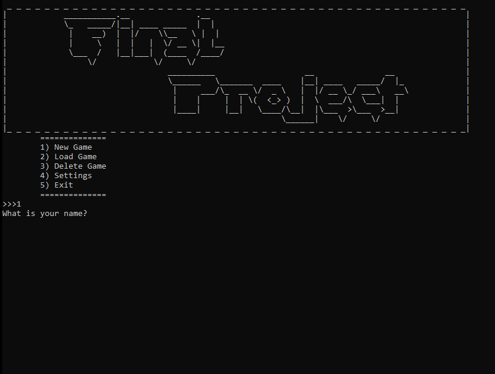
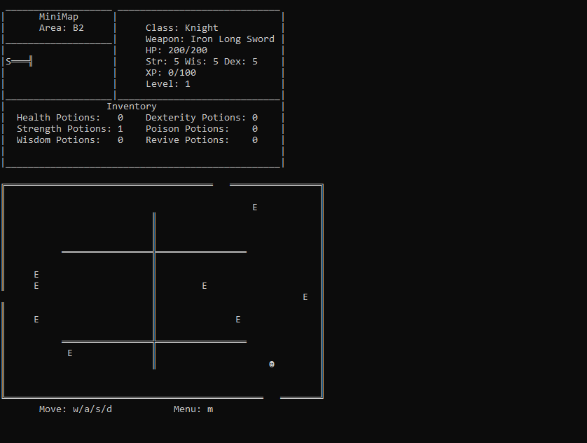
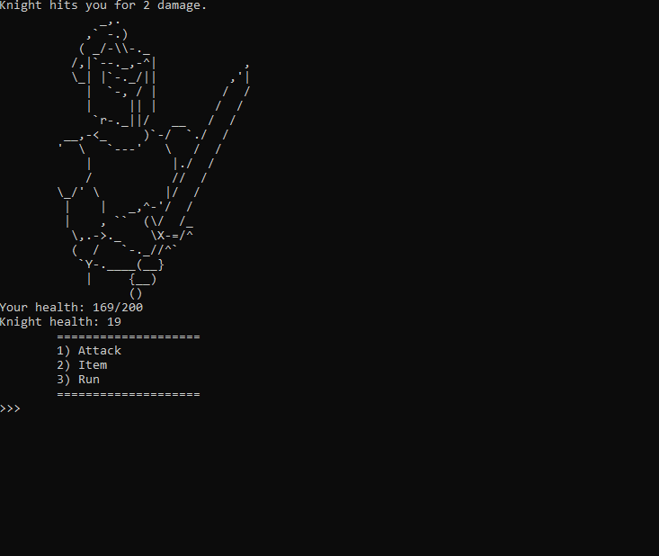
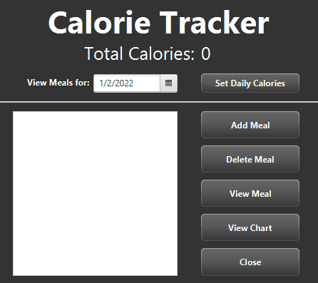
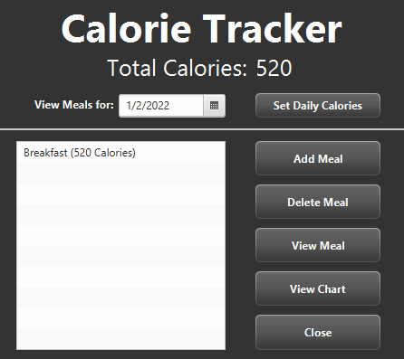
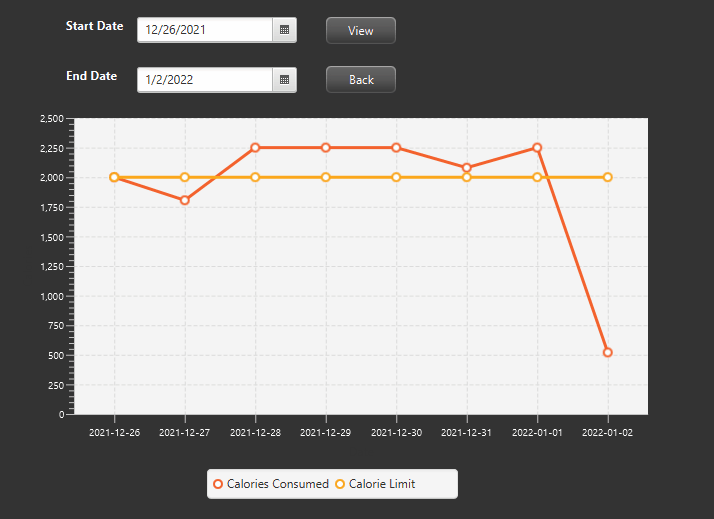
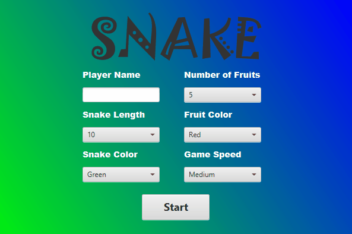
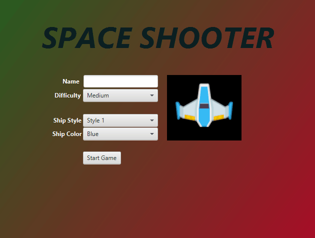

# Kevin Kozikowski

## Projects
  

### Python RPG
A python console-based game in which the player must level up while navigating through a dungeon to the final boss. The player fights enemies in turn-based RPG style battles, collecting items to help the player progress through the game. The game allows the player to save the state of the game as well as save/load multiple other player files. 

   

Credit:

  
Knight enemy image - by <a href="https://www.asciiart.eu/people/occupations/knights">[unknown artist]</a>

  
Knight player image - by <a href="https://www.asciiart.eu/people/occupations/knights"> Joan G. Stark (jgs)</a>

  

### Calorie Tracker
JavaFX GUI application following MVC structure. The application allows the user to view a graph of their meal data over time as well as store data locally and add, update, and delete that data through use of a DAO.

    

  

### Snake Clone
A small snake game type clone with additional settings to become familiarized with JavaFX and event handling.

  

### Space Invaders Clone (WIP)
A space invaders type game using JavaFX in which the player fights waves of enemies to progress through levels. 

  

   
